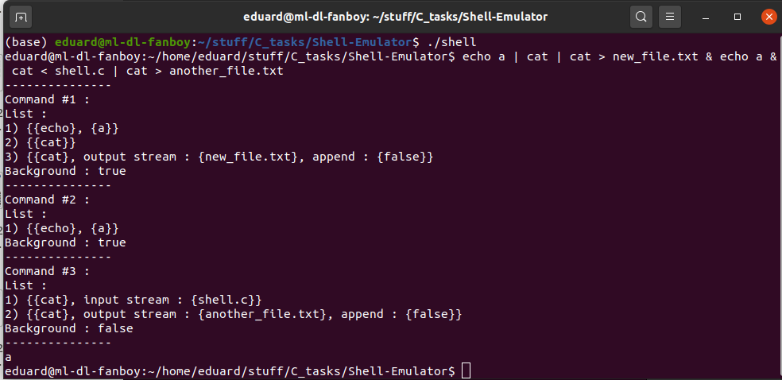

# Shell-Emulator

Supports traditional shell syntax with little exceptions, - you should specify redirections exactly in the end of every command, and in case of conveyour usage you can do it in the end of every mini-command, before '|' symbol.

## Build & Run

Execute ``` sudo chmod +x build.sh && ./build.sh && ./shell ```

Also, this program has flag ``` verbose ``` in ``` shell.c ``` file, change it to swap between modes.

## Default mode


## Verbose mode

